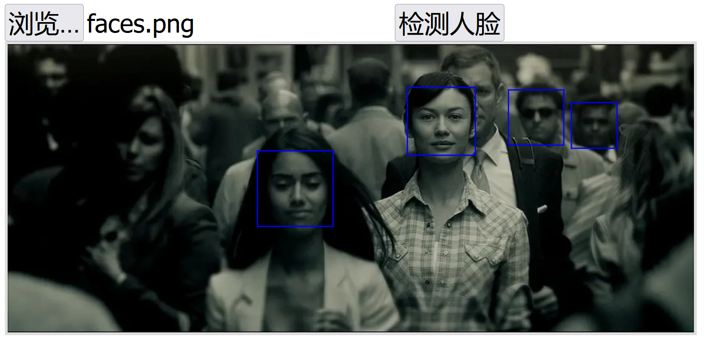

# rust-scf-facefinder
腾讯云函数SCF Custom Runtime部署Rust人脸检测



```JavaScript
var data = {
    img: base64,
    min_size: 60,
    shift_factor: 0.1,
    threshold: 0.2
};

fetch(url,{
    method: 'POST',
    body: JSON.stringify(data),
    headers: getHeader()
}).then(res => {
    res.json().then(faces => {
        ctx.strokeStyle="blue";
        ctx.lineWidth = 2;
        faces.forEach(face => {
            ctx.strokeRect(face.rect.left, face.rect.top, face.rect.width, face.rect.height);
        });
    });
})
```

### *如何编译*

Windows环境下，需要在Linux子系统编译，编译脚本如下：

```PowerShell
## 在windows控制台输入bash，进入linux子系统
bash
```

```bash
## 静态链接编译
RUSTFLAGS='-C target-feature=+crt-static' cargo build --target=x86_64-unknown-linux-gnu --release
## 复制编译好的文件
cp target/x86_64-unknown-linux-gnu/release/scf-server pkg/bootstrap
cd pkg
## 给文件添加执行权限
chmod 755 ./bootstrap
## 打包zip
zip pkg.zip bootstrap
```

### *云函数上传和部署*

进入腾讯Serverless控制台的云函数管理，在函数代码中，选择“本地上传zip包”，上传并部署。


### *测试*

- 修改测试 html 文件中的远程API的地址信息

idnex.html#L87

```js

# 替换地址为 APIGW 触发器地址

const url = "https://service-xxxx.gz.apigw.tencentcs.com/release/rust-facedector-demo";
                                                                                        
img.onload = function () {
  console.log('img=', img);
  canvas.width = img.width;
  canvas.height = img.height;
  canvas.style.width = img.width + 'px';
  canvas.style.height = img.height + 'px';
  ctx.drawImage(img, 0, 0);
};
img.src = "faces.png"

```
- 打开本地的 test 目录 `index.html` 文件
- 选择 png 文件，目录 `test/pngs` 有部分样本文件
- 点击 按钮进行人脸监测

### *其他*

- 为了方便测试，添加触发器的时候不开启鉴权
- 添加 APIGW 触发器的时候，需要选择集成响应模式，SCF 返回 APIGW 指定的内容格式
- 编译应用的时候，需要基于 Linux x86_64 架构进行编译，推荐采用 Centos 系统
- 需要在 APIGW 控制台开启允许 `CORS` 跨域请求


### *引用*

- 参考链接：[在腾讯云上部署一个Rust人脸检测云函数](https://zhuanlan.zhihu.com/p/476715251)
